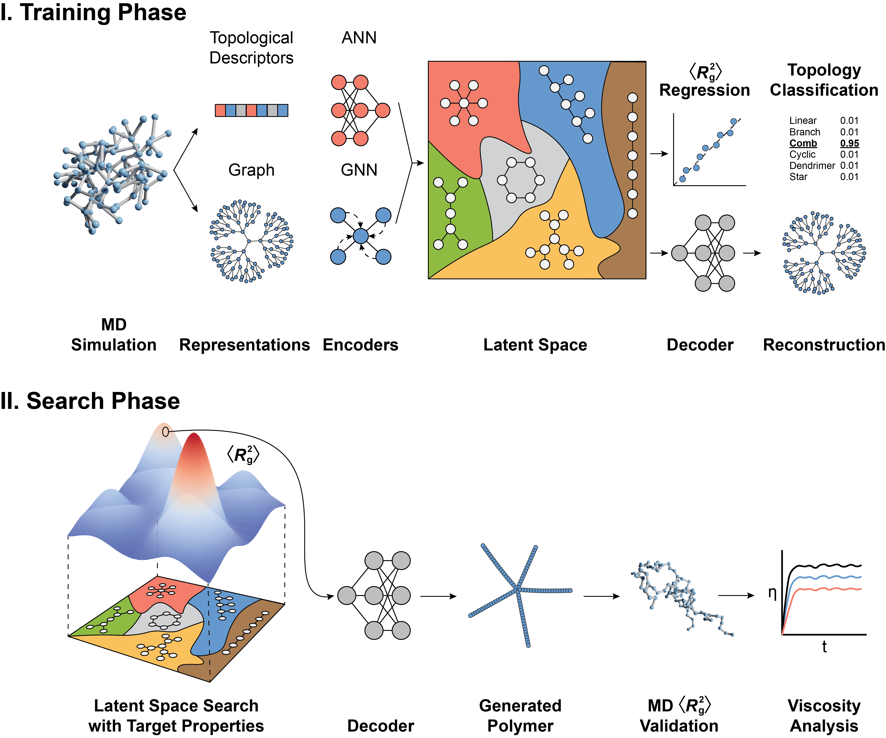

# poly-topoGNN-vae



## Overview
All content here is available under CC BY NC 4.0 License

Please consider citing references, as pertinent.

The repository is structured with Python files and Jupyter notebooks. All figures in the paper can be reproduced by running the `figure_data.ipynb` and `figure_result.ipynb` notebooks. Below are the files and their respective functions.

- `analysis_utils.py` contains functions to compute accuracy metrics (e.g., reconstruction balanced accuracy, $\langle R_\mathrm{g}^2 \rangle$, regression $R^2$, and topology classification $F_1$) derived from predictions and hyperparameter tuning based on the validation dataset.
- `data_utils.py` contains a function to extract topological descriptors from a `networkx.graph` object and another function to load and split the data for training.
- `graph_utils.py` contains functions to clean up a generated graph from the VAE to make it more realistic.
- `saliency_utils.py` computes the saliency map of a model, understanding the importance of topological descriptors on $\langle R_\mathrm{g}^2 \rangle$) regression.
- `model_utils.py` contains all encoder and decoder models and auxiliary functions for VAE training.

The Jupyter notebooks are
- `result.ipynb` contains all the procedures to generate result pickle files. One thing to note is that the VAE sampling layer is inherently random, reproducing with different seeds may lead to slightly different results.
- `diversity.ipynb` contains model diversity measurements using [Vendi Score](https://github.com/vertaix/Vendi-Score)).
- `figure_data.ipynb` can be used to reproduce all figures related to the data (e.g. $\langle R_\mathrm{g}^2 \rangle$ distribution and topology visualization).
- `figure_result.ipynb` can be used to reproduce all figures related to the results (e.g. reconstruction accuracy, property guided polymer generation and viscosity and analysis).

In addition, if you are only interested in property guided polymer generation, there is a playground notebook `polymer_generation_playground.ipynb` where you can randomly set the target $\langle R_\mathrm{g}^2 \rangle$ and topology and visualize the generated polymer topologies.


## References

### Download Data
The data is publicly available at ...

Make sure to change the directory in each file to your own directory.

### Install Packages
```bash
python = 3.8
tensorflow = 2.5.0
spektral = 1.3.0
networkx = 2.8.4
scikit-learn = 1.2.2
proplot = 0.9.7
vendi-score = 0.0.3
```

### Code
To train the VAE with hyperparameter tuning:
```
#SBATCH --job-name=job_name      # create a short name for your job
#SBATCH --output=slurm.%a.out    # stdout file
#SBATCH --error=slurm.%a.err     # stderr file
#SBATCH --nodes=1                # node count
#SBATCH --ntasks=1               # total number of tasks across all nodes
#SBATCH --cpus-per-task=1        # cpu-cores per task (>1 if multi-threaded tasks)
#SBATCH --mem-per-cpu=8G         # memory per cpu-core (4G is default)
#SBATCH --gres=gpu:1             # number of gpus per node
#SBATCH --time=48:00:00          # total run time limit (HH:MM:SS)
#SBATCH --array=0-8              # job array with index values 0, 1, 2, 3, 4

echo "My SLURM_ARRAY_TASK_ID is $SLURM_ARRAY_TASK_ID"
echo "Executing on the machine:" $(hostname)

export PATH="${PATH}:/usr/local/nvidia/bin:/usr/local/cuda/bin"

module purge
module load anaconda3/your_conda_module
conda activate your_conda_env

python run_vae.py > "python-$SLURM_ARRAY_TASK_ID.out" > "python-$SLURM_ARRAY_TASK_ID.err"
```
